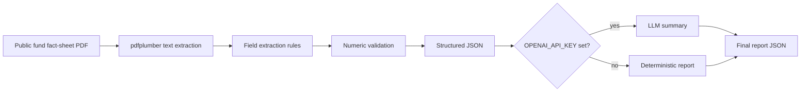

# Investment Document Data Extraction & Summarizer

A document-processing pipeline for public investment fund fact sheets. It extracts structured fields from PDFs with `pdfplumber`, validates numeric claims with deterministic rules, and optionally summarizes the extracted content with an LLM.

## Problem

Fund documents are semi-structured and change layout across managers. A useful workflow needs to separate **what the PDF says** from **what an LLM summarizes**. This project extracts first, validates second, and only then summarizes.

## Data flow



## Extracted fields

- Fund name
- Strategy
- Asset class
- Management fee / expense ratio when present
- Top holdings when present
- As-of date
- Raw text for auditability
- Validation flags

## Validation rules

- Fee percentages must be between 0% and 100%.
- Holding weights must be between 0% and 100%.
- When enough holding weights are extracted, their sum cannot exceed 100% beyond the configured tolerance.
- Validation failures are never silently corrected.

## Setup

```bash
python3 -m venv .venv
source .venv/bin/activate
pip install -e '.[test,llm]'
pytest -q
```

The core extractor does not need an API key. LLM summarization requires `OPENAI_API_KEY`.

## Run

Extraction only:

```bash
investment-doc examples/sample_fact_sheet.pdf --output output/report.json
```

Extraction + LLM summary:

```bash
export OPENAI_API_KEY='...'
investment-doc examples/sample_fact_sheet.pdf --output output/report.json --summarize
```

The LLM layer receives extracted text and structured fields; it is not trusted to invent or repair numbers.

## Sample output

```json
{
  "fund_name": "Example Global Equity Fund",
  "strategy": "Long-term global equity growth",
  "asset_class": "Equity",
  "management_fee_pct": 0.65,
  "top_holdings": [{"name": "Example Technology Co", "weight_pct": 5.2}],
  "validation": {"valid": true, "errors": []},
  "summary": "A global equity strategy focused on long-term capital growth..."
}
```

## Project structure

```text
src/investment_docs/
  extractor.py
  validator.py
  summarizer.py
  cli.py
tests/
examples/sample_fact_sheet.pdf
```

## Sources

Use public documents for examples and respect the source manager's terms. `pdfplumber` is used for local PDF text extraction; the LLM layer is optional.
