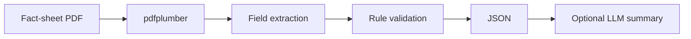

# Investment Document Data Extraction & Summarizer

A PDF-processing pipeline for public investment fund fact sheets. It extracts structured fields with `pdfplumber`, validates numeric claims deterministically, and optionally summarizes the result with an LLM.

## Setup
```bash
python3 -m venv .venv
source .venv/bin/activate
pip install -e '.[test,llm]'
pytest -q
```

Extraction only:
```bash
investment-doc examples/sample_fact_sheet.pdf --output output/report.json
```

LLM summary requires `OPENAI_API_KEY` and is deliberately separated from numeric validation.

## Data flow


## Extracted fields
Fund name, strategy, asset class, management fee/expense ratio, top holdings, raw extracted text, and validation flags.

## Validation
Fees and holding weights are range-checked, holding totals are checked against a tolerance, and failures are never silently corrected.

Educational/research project.